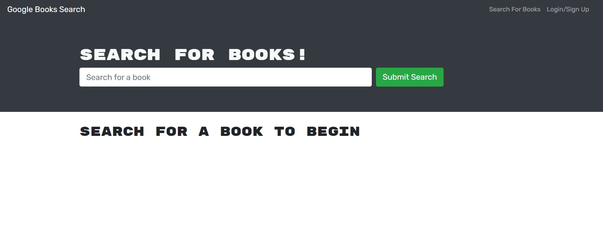
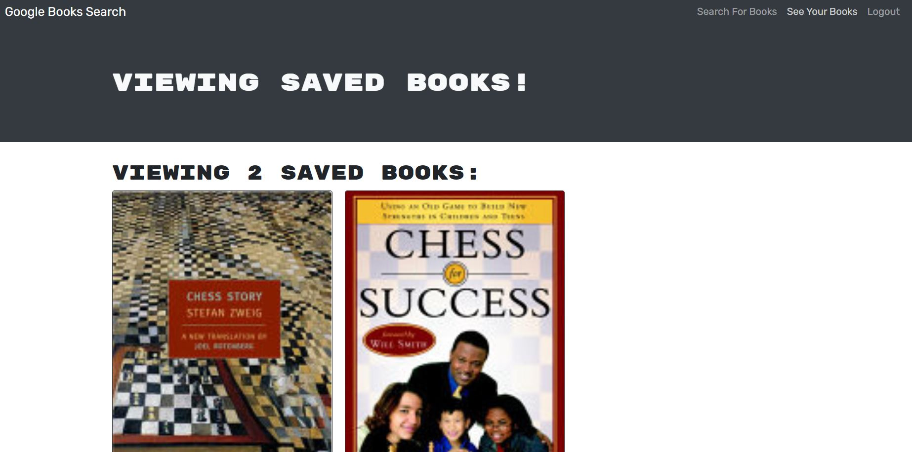

# MERN: Book Search Engine


## 📝 Description

```
The Book Search Engine app allows you to search for books usin the Google
API.

You can create a login and save a link and description of books you like to
your profile.

This is a functioning application that used a RESTful backend for it's API
searching. It has been modified to use GraphQL as an alternative to the 
RESTful API routes.
```

## 🧰 Technologies Used

- `Express Node.js`
- `npm (Node Package Manager)`
- `Javascript`
- `Apollo Server`
- `Bootstrap`
- `GraphQL`
- `Bcrypt`
- `Mongoose`
- `MongoDB Atlas`
- `REACT`

## 📄 Installation Instructions

You will need to run npm install from the root directory as well as from the 
server and client folders to install all required packages. 

## 🤸‍♂️ Challenges/Successes

- Getting a through understanding of the applications existing functionality proved to be challenging.
  - Spent a lot of time going throught the client and server logic as is before moving on to modifying and adding new files to the project.
- Had issues with getting the GraphQL url to load on port 3001. Found that there
was a syntax error in the typeDefs.js file. 

## 📸 Screenshots

> Below are screenshots and links of the deployed application.

**HOMEPAGE**



**SEARCH RESULTS**


**SAVED BOOKS**



## 🔗 Project Links

[Heroku Deployment](https://protected-reef-01460.herokuapp.com/)

[Github Repository](https://github.com/malmason/book-search-engine)

## 📱 Contact

Malcolm Mason - [Github](https://github.com/malmason) Email: [Malcolm](mailto:malmason66@gmail.com) 📧

---

&copy; 2021 Malcolm Mason
